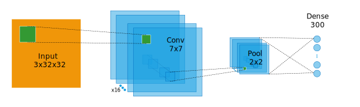

Neural Network Layer Definition
-------------------------------

There are two supported methods of providing a Layer Definition to the :class:`.NeuralNet` constructor.
The first involve generating the stack of :mod:`lasagne.layer` instances directly, while the second passes a dictionary
and relies on the NeuralNet constructor to instantiate the layers.

The sample network below is given as an example

Passing a Layer Instance Directly
~~~~~~~~~~~~~~~~~~~~~~~~~~~~~~~~~
The newer method is to simply set up a stack of layer instances, and pass the output layer to the constructor.
This method is more versatile, and supports all types of :mod:`lasagne.layers`

.. code-block:: python

    from lasagne import layers

    l_input = layers.InputLayer(shape=(None,3,32,32), name="input")
    l_conv  = layers.Conv2DLayer(l_input, num_filters=16, filter_size=7, pad="same", stride=1, name="conv")
    l_pool  = layers.MaxPool2dLayer(l_conv, pool_size=2, stride=2, name="pool")
    l_dense = layers.DenseLayer(l_pool,num_units=300, name="dense")

    net = NeuralNet(layers = l_dense)

Passing a dictionary of LayerTypes
~~~~~~~~~~~~~~~~~~~~~~~~~~~~~~~~~~
The second method involves creating a diction where the key is the layer name, and the value is the layer type.

Additional parameters are passed to the layer constructors by prepending the parameter name with the layer name,
and passing it as a kwarg to the NeuralNet.

The dictionary method is less versatile, and is unable to accommodate some of the newer lasagne features.

.. code-block:: python

    from lasagne import layers

    layer_dict = {"input":layers.InputLayer,
                  "conv":layers.Conv2DLayer,
                  "pool":layers.MaxPool2DLayer,
                  "dense":layers.DenseLayer}

    layer_kwargs = {"input_shape":(None,3,32,32),
                    "conv_filter_size": 7,
                    "conv_pad": "same",
                    "conv_stride": 1,
                    "conv_num_filters": 16,
                    "pool_pool_size":2,
                    "pool_stride":2,
                    "num_units":300}

    net = NeuralNet(layers=layer_dict,**layer_kwargs)

.. note:: The `layer_dict` value is a layer type, **not** an instance of the layer type.